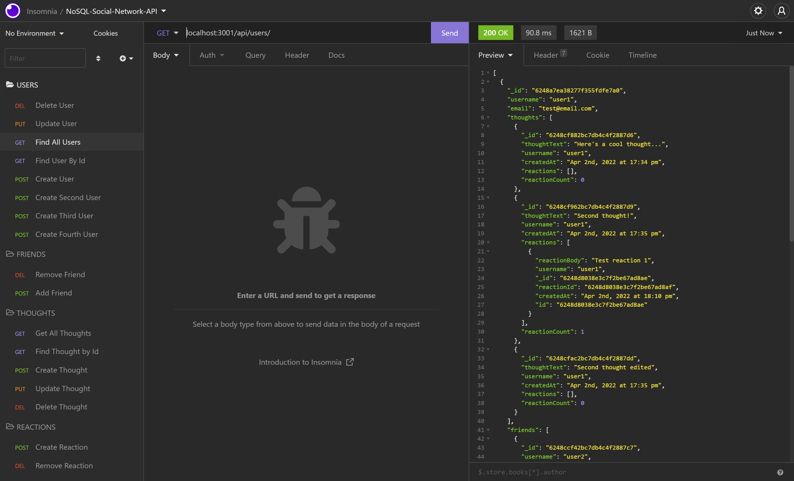

  
  # NoSQL-Social-Network-API
  

  ## Description
  NoSQL API for social media application, where users can share their thoughts, create a friend's list, and react to friend's thoughts.

  ## Preview
  
  [Walkthrough Video](https://drive.google.com/file/d/1Syb-fJ8CSP1-D3PGfvBr45s7s2U1I4Hm/view)

  ## Table of Contents
  * [Installation](#Installation)
  * [Usage](#Usage)
  * [Credits](#Credits)
  * [License](#License)
  * [Contributions](#Contributions)
  * [Test](#Test)
  * [Questions](#Questions)
  

  ## Installation
  Users download the repo and run from Visual Studio Code, or their preferred editor. Required packages include Express.js and Mongoose. 
  
  The data from my repo is currently hosted by MongoDB Atlas, but users can create their own local environment if they prefer.
  
  To emulate without a front-end for the application, use Insomnia or Postman to test routes for Users and Thoughts. 
  
  Currently the database is set up to add users, create and delete friends, create, edit and delete thoughts, create and delete reactions to thoughts. If a user is deleted, their associated thoughts are also removed from the database.

  ## Usage
  Run in Insomnia after creating required routes, as listed in /routes folder.

  ## Credits
  Thanks to @kyler-Mclachlan for sharing your sharp eyes when one of my routes was not working! 🦅

  ## License
  
  
  ### MIT License

  Copyright 2022 Claire Rosenfrisk

  Permission is hereby granted, free of charge, to any person obtaining a copy of this software and associated documentation files (the "Software"), to deal in the Software without restriction, including without limitation the rights to use, copy, modify, merge, publish, distribute, sublicense, and/or sell copies of the Software, and to permit persons to whom the Software is furnished to do so, subject to the following conditions:
      
  The above copyright notice and this permission notice shall be included in all copies or substantial portions of the Software.
      
  THE SOFTWARE IS PROVIDED "AS IS", WITHOUT WARRANTY OF ANY KIND, EXPRESS OR IMPLIED, INCLUDING BUT NOT LIMITED TO THE WARRANTIES OF MERCHANTABILITY, FITNESS FOR A PARTICULAR PURPOSE AND NONINFRINGEMENT. IN NO EVENT SHALL THE AUTHORS OR COPYRIGHT HOLDERS BE LIABLE FOR ANY CLAIM, DAMAGES OR OTHER LIABILITY, WHETHER IN AN ACTION OF CONTRACT, TORT OR OTHERWISE, ARISING FROM, OUT OF OR IN CONNECTION WITH THE SOFTWARE OR THE USE OR OTHER DEALINGS IN THE SOFTWARE.
  

  ## Contributions
  Users can contribute by messaging @crosenfrisk on GitHub, or email Claire at the email address listed below.

  ## Test
  Use Insomnia or other platform to test routes.

  ## Questions
  If you have any questions about this project, please contact me directly at [claire.rosenfrisk@gmail.com](mailto:claire.rosenfrisk@gmail.com). You can view more of my work on  [My GitHub Profile](https://github.com/crosenfrisk).

